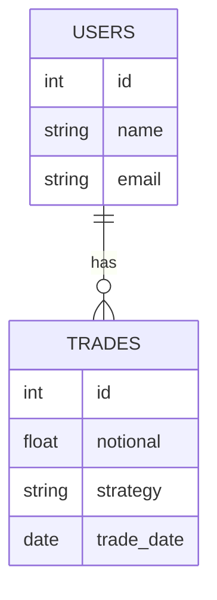

```mermaid
erDiagram
    USERS ||--o{ TRADES : has
    USERS {
        int id
        string name
        string email
    }
    TRADES {
        int id
        float notional
        string strategy
        date trade_date
    }
```