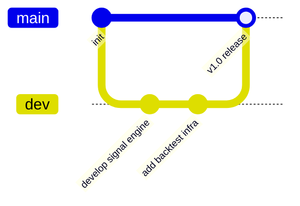

```mermaid
gitGraph
    commit id: "init"
    branch dev
    checkout dev
    commit id: "develop signal engine"
    commit id: "add backtest infra"
    checkout main
    merge dev id: "v1.0 release"
```